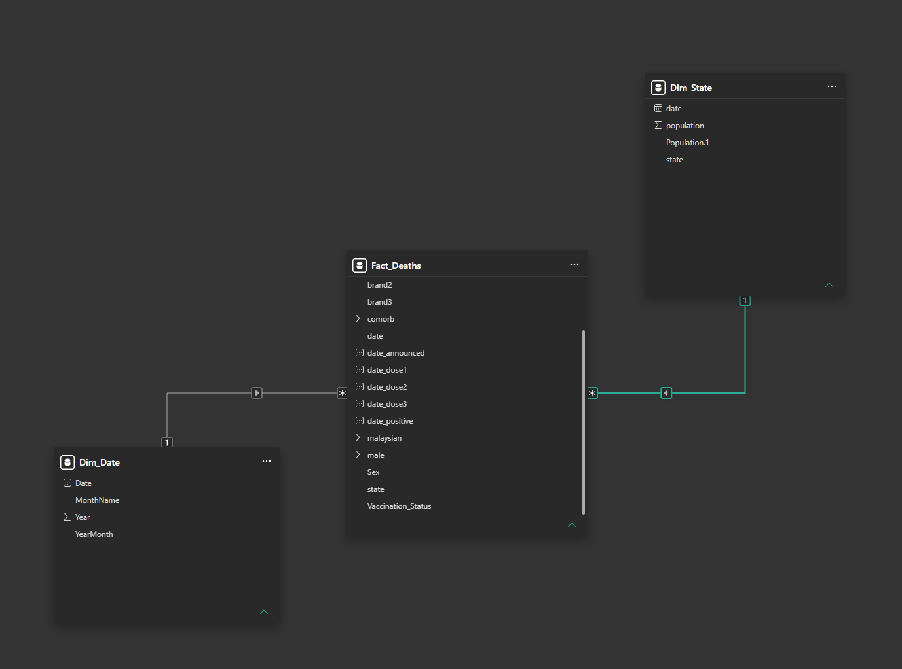
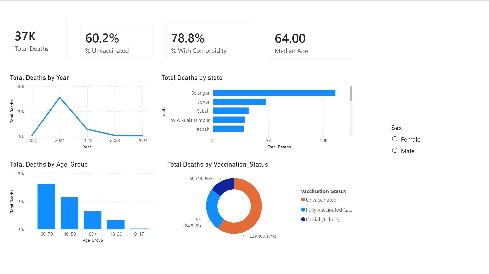

<!-- _class: lead -->
<!-- _paginate: false -->

# Transforming Medical Statistics with Power BI

**Slot 1 — 25 Jun 2026 (Thursday)**
Kursus Lanjutan (Advanced) — Pegawai Tadbir (Rekod Perubatan) & Penolong
KKM 2026

Dr. Muhammad Naufal bin Nordin

---

## What is Power BI?

- A **business intelligence** tool from Microsoft.
- Turns raw data (Excel, CSV, databases) into interactive **dashboards** & **reports**.
- For Medical Records: move from **manual Excel statistics** → **automatic dashboards** that are always up to date.

---

## The 5 types of analytics

- **Descriptive** — what happened? (counts, trends → *today's dashboard*)
- **Diagnostic** — why did it happen? (slicing, drill-down → *also today*)
- **Predictive** — what will happen? (forecasting → *Module 2 / AI*)
- **Prescriptive** — what should we do? (recommendations)
- **Continuous** — real-time, always-on automated analytics

---

## Why it matters for KKM

- **Automate** counts and rates — no more manual tallying.
- **Filter** by state, age group, or vaccination status in one click.
- **Share** consistent figures with management — everyone sees the same numbers.

---

## The Power BI workflow

```
Get Data → Transform → Model → Visualize → Share
```

1. **Get Data** — import CSV/Excel/database.
2. **Transform** — clean & shape the data (Power Query).
3. **Model** — define relationships between tables.
4. **Visualize** — build charts & dashboards.
5. **Share** — publish/export to others.

---

## A quick tour: 3 views

Three views on the left side of Power BI Desktop:

- **Report view** — canvas for building visuals & dashboards.
- **Data view** — inspect tables (rows & columns).
- **Model view** — manage relationships between tables.

---

## What is a data model?



- **Fact table** — the events (e.g. each death).
- **Dimension table** — the context (date, state, age group).
- Intuition: **related smaller tables**, not one big flat table — a **star schema**.
- Today: **Deaths** fact + **Date** and **State** dimensions.

---

## What is a measure (DAX)?

- **Column** — a stored value, fixed per row (e.g. *State*, *Age*).
- **Measure** — a calculation evaluated **in context**, using DAX (e.g. *Total Deaths*, *Deaths per 100k*).
- Measures recalculate automatically as you filter or slice the report.

---

## Today's data

- Source: **data.gov.my** — open government data.
- Dataset: **COVID-19 deaths line-list**.
- **One row = one death.**
- ~37,000 deaths, **2020–2024**, by state, age, sex, comorbidity, and vaccination status.

---

## Is this safe to use?

- Open, **aggregate / de-identified** government data → safe to share, publish, and teach with.
- **Never** upload real patient records or confidential documents to any cloud/AI tool.
- This rule applies beyond today's class — it's a standing data-security principle.

---

## What we'll build today

A one-page dashboard with:

- **KPI cards** — total deaths, key summary numbers.
- **Line chart** — deaths over time.
- **Bar chart** — deaths by state.
- **Breakdown by age group.**
- **Donut chart** — vaccination status.
- **Slicers** — to filter everything above interactively.

---

## The finished dashboard



---

## Follow-along ground rules

- Everyone builds on their **own laptop**.
- Data files are in `module-1-power-bi/data/`.
- **Raise your hand** if you get stuck — don't wait.
- We save **checkpoints** along the way so you can rejoin at any point.

---

<!-- _class: lead -->

# Let's build → hands-on-guide
